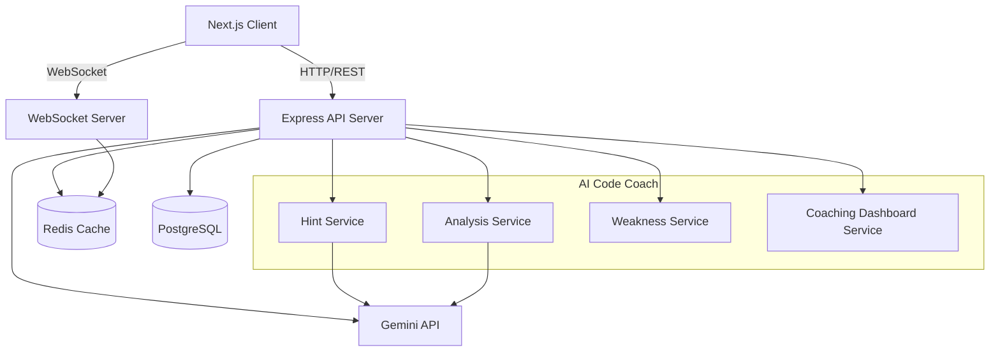
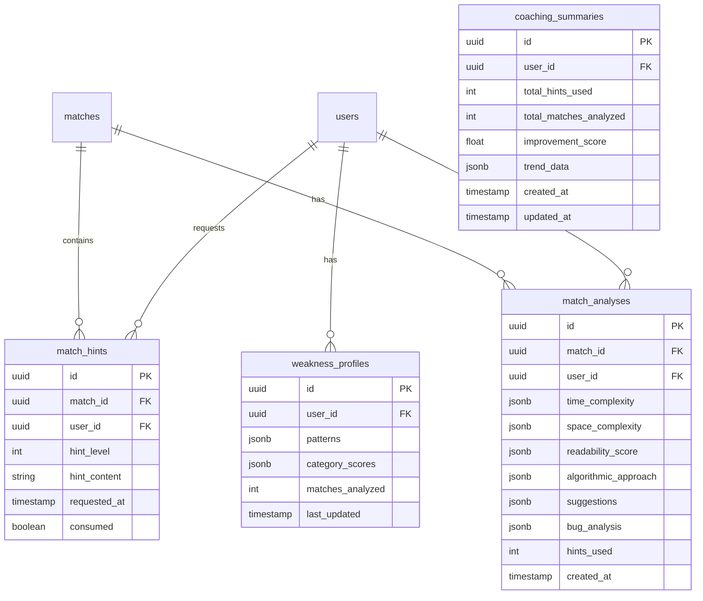

# Design Document

## Overview

The AI Code Coach extends the Phantom Code Battle platform with intelligent real-time assistance and post-match analysis. Building on the existing Gemini integration, this feature provides contextual hints during matches, comprehensive post-match code reviews, weakness tracking across matches, and a coaching dashboard for long-term improvement tracking.

### Key Design Principles

1. **Non-Intrusive Assistance**: Hints guide without revealing solutions
2. **Fair Competition**: Hint usage incurs score penalties to maintain competitive balance
3. **Progressive Learning**: Hints escalate in specificity; weakness tracking enables targeted improvement
4. **Graceful Degradation**: Fallback mechanisms when AI service is unavailable
5. **Data-Driven Insights**: Persistent analysis enables trend tracking and personalized coaching

## Architecture

### Extended System Architecture



### New Database Tables



## Components and Interfaces

### Backend Services

#### 1. Hint Service

```typescript
interface HintRequest {
  matchId: string;
  userId: string;
  challengeId: string;
  currentCode: string;
  language: string;
  hintLevel: number; // 1, 2, or 3
}

interface HintResponse {
  id: string;
  content: string;
  level: number;
  levelIndicator: string; // "1/3", "2/3", "3/3"
  consumed: boolean;
  cooldownRemaining: number; // seconds until next hint allowed
}

interface HintService {
  // Request a hint during a match
  requestHint(request: HintRequest): Promise<HintResponse>;

  // Check if hint is available (cooldown + limit)
  canRequestHint(
    matchId: string,
    userId: string
  ): Promise<{
    allowed: boolean;
    reason?: string;
    cooldownRemaining?: number;
    hintsRemaining?: number;
  }>;

  // Get hints used in a match
  getMatchHints(matchId: string, userId: string): Promise<HintResponse[]>;

  // Calculate score penalty based on hints used
  calculateScorePenalty(hintsUsed: number): number;

  // Get fallback hint when AI unavailable
  getFallbackHint(challengeCategory: string, hintLevel: number): string;
}
```

#### 2. Analysis Service

```typescript
interface MatchAnalysis {
  id: string;
  matchId: string;
  userId: string;
  timeComplexity: {
    detected: string; // e.g., "O(n²)"
    optimal: string; // e.g., "O(n log n)"
    explanation: string;
  };
  spaceComplexity: {
    detected: string;
    optimal: string;
    explanation: string;
  };
  readabilityScore: {
    score: number; // 0-10
    strengths: string[];
    improvements: string[];
  };
  algorithmicApproach: {
    detected: string; // e.g., "Brute Force"
    suggested: string; // e.g., "Dynamic Programming"
    explanation: string;
  };
  suggestions: string[]; // 3-5 actionable items
  bugAnalysis: {
    hasBugs: boolean;
    bugs: Array<{
      location: string;
      description: string;
      suggestion: string;
    }>;
  };
  hintsUsed: number;
  createdAt: Date;
}

interface AnalysisService {
  // Generate post-match analysis
  generateAnalysis(matchId: string, userId: string, code: string, language: string, challengeId: string, testResults: TestResult[], isWinner: boolean): Promise<MatchAnalysis>;

  // Get analysis for a match
  getAnalysis(matchId: string, userId: string): Promise<MatchAnalysis | null>;

  // Get historical analyses with pagination
  getAnalysisHistory(userId: string, page: number, pageSize: number): Promise<{ analyses: MatchAnalysis[]; total: number }>;
}
```

#### 3. Weakness Service

```typescript
interface WeaknessPattern {
  category: "time_complexity" | "space_complexity" | "readability" | "patterns";
  pattern: string; // e.g., "Nested loops when linear solution exists"
  frequency: number; // How often this appears
  lastSeen: Date;
}

interface WeaknessProfile {
  id: string;
  userId: string;
  patterns: WeaknessPattern[];
  categoryScores: {
    time_complexity: number; // 0-100
    space_complexity: number;
    readability: number;
    patterns: number;
  };
  matchesAnalyzed: number;
  lastUpdated: Date;
}

interface WeaknessSummary {
  topWeaknesses: WeaknessPattern[]; // Top 3
  strongestArea: string;
  improvementTrend: "improving" | "stable" | "declining";
}

interface WeaknessService {
  // Update weakness profile after match
  updateWeaknessProfile(userId: string, analysis: MatchAnalysis): Promise<WeaknessProfile>;

  // Get weakness profile
  getWeaknessProfile(userId: string): Promise<WeaknessProfile | null>;

  // Get weakness summary (top 3)
  getWeaknessSummary(userId: string): Promise<WeaknessSummary>;

  // Get pre-match tip based on weaknesses
  getPreMatchTip(userId: string, challengeCategory: string): Promise<string | null>;

  // Check if enough matches for weakness detection (>= 5)
  hasEnoughDataForWeaknessDetection(userId: string): Promise<boolean>;
}
```

#### 4. Coaching Dashboard Service

```typescript
interface CoachingSummary {
  totalHintsUsed: number;
  totalMatchesAnalyzed: number;
  improvementScore: number; // 0-100
  averageAnalysisScore: number;
}

interface SkillTimeline {
  entries: Array<{
    matchId: string;
    date: Date;
    scores: {
      time_complexity: number;
      space_complexity: number;
      readability: number;
      patterns: number;
    };
  }>;
}

interface CategoryFeedback {
  category: string;
  feedbackItems: Array<{
    matchId: string;
    date: Date;
    feedback: string;
  }>;
}

interface TrendData {
  category: string;
  dataPoints: Array<{
    matchNumber: number;
    score: number;
  }>;
  trend: "improving" | "stable" | "declining";
}

interface CoachingDashboardService {
  // Get coaching summary
  getSummary(userId: string): Promise<CoachingSummary>;

  // Get skill progression timeline
  getTimeline(userId: string): Promise<SkillTimeline>;

  // Get categorized feedback history
  getCategorizedFeedback(userId: string): Promise<CategoryFeedback[]>;

  // Get full analysis for a specific match
  getMatchDetail(
    matchId: string,
    userId: string
  ): Promise<{
    analysis: MatchAnalysis;
    hints: HintResponse[];
  }>;

  // Get improvement trends (last 10 matches)
  getTrends(userId: string): Promise<TrendData[]>;
}
```

### API Endpoints

#### Hint Routes (`/api/coach/hints`)

```typescript
POST /api/coach/hints/request
Request: { matchId: string, currentCode: string, language: string }
Response: { hint: HintResponse } | { error: string, cooldownRemaining?: number }

GET /api/coach/hints/status/:matchId
Response: {
  canRequest: boolean,
  hintsUsed: number,
  hintsRemaining: number,
  cooldownRemaining: number
}

GET /api/coach/hints/match/:matchId
Response: { hints: HintResponse[] }
```

#### Analysis Routes (`/api/coach/analysis`)

```typescript
POST /api/coach/analysis/generate
Request: { matchId: string }
Response: { analysis: MatchAnalysis }

GET /api/coach/analysis/:matchId
Response: { analysis: MatchAnalysis }

GET /api/coach/analysis/history
Query: { page?: number, pageSize?: number }
Response: { analyses: MatchAnalysis[], total: number, page: number }
```

#### Weakness Routes (`/api/coach/weakness`)

```typescript
GET /api/coach/weakness/profile
Response: { profile: WeaknessProfile }

GET /api/coach/weakness/summary
Response: { summary: WeaknessSummary }

GET /api/coach/weakness/tip/:challengeCategory
Response: { tip: string | null }
```

#### Dashboard Routes (`/api/coach/dashboard`)

```typescript
GET /api/coach/dashboard/summary
Response: { summary: CoachingSummary }

GET /api/coach/dashboard/timeline
Response: { timeline: SkillTimeline }

GET /api/coach/dashboard/feedback
Response: { feedback: CategoryFeedback[] }

GET /api/coach/dashboard/match/:matchId
Response: { analysis: MatchAnalysis, hints: HintResponse[] }

GET /api/coach/dashboard/trends
Response: { trends: TrendData[] }
```

### WebSocket Events

```typescript
// Client → Server
'request_hint': { matchId: string, currentCode: string, language: string }

// Server → Client
'hint_response': { hint: HintResponse }
'hint_error': { error: string, cooldownRemaining?: number }
'hint_status_update': { hintsUsed: number, hintsRemaining: number }

// Post-match
'analysis_ready': { matchId: string, analysis: MatchAnalysis }
'analysis_error': { matchId: string, error: string }
```

### Frontend Components

#### 1. Hint Overlay Component

```typescript
interface HintOverlayProps {
  matchId: string;
  onHintRequest: () => void;
  hintStatus: {
    canRequest: boolean;
    hintsUsed: number;
    hintsRemaining: number;
    cooldownRemaining: number;
  };
  currentHint: HintResponse | null;
}

// Non-intrusive overlay positioned at top-right of editor
// Shows hint level indicator (1/3, 2/3, 3/3)
// Cooldown countdown timer
// Hint content with syntax highlighting
```

#### 2. Post-Match Analysis Component

```typescript
interface PostMatchAnalysisProps {
  analysis: MatchAnalysis;
  isWinner: boolean;
}

// Expandable sections for each analysis category
// Visual complexity comparison (detected vs optimal)
// Suggestion cards with actionable items
// Bug location highlighting
```

#### 3. Coaching Dashboard Component

```typescript
interface CoachingDashboardProps {
  userId: string;
}

// Summary cards (hints used, matches analyzed, improvement score)
// Interactive timeline chart
// Category filter tabs
// Match history list with drill-down
// Trend visualization charts
```

#### 4. Weakness Summary Component

```typescript
interface WeaknessSummaryProps {
  summary: WeaknessSummary;
}

// Top 3 weakness cards
// Strongest area highlight
// Improvement trend indicator
// Link to full coaching dashboard
```

## Data Models

### Match Hint Model

```typescript
interface MatchHint {
  id: string;
  match_id: string;
  user_id: string;
  hint_level: number;
  hint_content: string;
  requested_at: Date;
  consumed: boolean; // false if generation failed
}
```

### Match Analysis Model

```typescript
interface MatchAnalysisRecord {
  id: string;
  match_id: string;
  user_id: string;
  time_complexity: {
    detected: string;
    optimal: string;
    explanation: string;
  };
  space_complexity: {
    detected: string;
    optimal: string;
    explanation: string;
  };
  readability_score: {
    score: number;
    strengths: string[];
    improvements: string[];
  };
  algorithmic_approach: {
    detected: string;
    suggested: string;
    explanation: string;
  };
  suggestions: string[];
  bug_analysis: {
    hasBugs: boolean;
    bugs: Array<{
      location: string;
      description: string;
      suggestion: string;
    }>;
  };
  hints_used: number;
  created_at: Date;
}
```

### Weakness Profile Model

```typescript
interface WeaknessProfileRecord {
  id: string;
  user_id: string;
  patterns: Array<{
    category: string;
    pattern: string;
    frequency: number;
    last_seen: Date;
  }>;
  category_scores: {
    time_complexity: number;
    space_complexity: number;
    readability: number;
    patterns: number;
  };
  matches_analyzed: number;
  last_updated: Date;
}
```

### Coaching Summary Model

```typescript
interface CoachingSummaryRecord {
  id: string;
  user_id: string;
  total_hints_used: number;
  total_matches_analyzed: number;
  improvement_score: number;
  trend_data: Array<{
    category: string;
    data_points: Array<{ match_number: number; score: number }>;
  }>;
  created_at: Date;
  updated_at: Date;
}
```

## Correctness Properties

_A property is a characteristic or behavior that should hold true across all valid executions of a system-essentially, a formal statement about what the system should do. Properties serve as the bridge between human-readable specifications and machine-verifiable correctness guarantees._

### Property 1: Hint cooldown enforcement

_For any_ two hint requests from the same user in the same match, if the second request occurs within 60 seconds of the first, the second request SHALL be rejected with a cooldown error. **Validates: Requirements 1.3**

### Property 2: Hint score penalty calculation

_For any_ base score and hint count between 0 and 3, the final score SHALL equal `baseScore * (1 - 0.05 * hintCount)`, resulting in 0%, 5%, 10%, or 15% penalty respectively. **Validates: Requirements 1.5**

### Property 3: Hint limit enforcement

_For any_ match where a user has already used 3 hints, subsequent hint requests SHALL be rejected with a limit reached error. **Validates: Requirements 1.6**

### Property 4: Hint level indicator correctness

_For any_ hint level N (where N is 1, 2, or 3), the level indicator string SHALL be exactly "N/3". **Validates: Requirements 2.4**

### Property 5: Analysis structure completeness

_For any_ generated match analysis, the analysis object SHALL contain non-null values for timeComplexity, spaceComplexity, readabilityScore, and algorithmicApproach fields. **Validates: Requirements 3.2**

### Property 6: Suggestion count bounds

_For any_ completed match analysis, the suggestions array SHALL contain between 3 and 5 items inclusive. **Validates: Requirements 3.4**

### Property 7: Weakness detection threshold

_For any_ user with fewer than 5 completed matches, the weakness detection service SHALL return an indication that insufficient data exists for pattern detection. **Validates: Requirements 4.2**

### Property 8: Weakness summary size

_For any_ user with a weakness profile, the weakness summary SHALL contain at most 3 weakness patterns. **Validates: Requirements 4.3**

### Property 9: Weakness profile freshness

_For any_ match completion that triggers weakness analysis, the weakness profile's lastUpdated timestamp SHALL be greater than or equal to the match completion timestamp. **Validates: Requirements 4.5**

### Property 10: Dashboard summary completeness

_For any_ coaching dashboard summary request, the response SHALL contain totalHintsUsed, totalMatchesAnalyzed, and improvementScore fields with numeric values. **Validates: Requirements 5.1**

### Property 11: Timeline chronological ordering

_For any_ skill timeline returned by the dashboard, the entries SHALL be ordered by date in ascending order (oldest first). **Validates: Requirements 5.2**

### Property 12: Feedback categorization completeness

_For any_ categorized feedback response, the categories SHALL include exactly: time_complexity, space_complexity, readability, and patterns. **Validates: Requirements 5.3**

### Property 13: Match analysis retrieval completeness

_For any_ match detail request for a match with stored analysis, the response SHALL contain both the full analysis object and the list of hints used. **Validates: Requirements 5.4**

### Property 14: Trend calculation window

_For any_ trend data request, the data points SHALL be calculated from at most the last 10 matches for that user. **Validates: Requirements 5.5**

### Property 15: Hint context completeness

_For any_ hint generation request sent to the AI service, the request context SHALL include challengeDescription, visibleTestCases, and currentCode fields. **Validates: Requirements 6.1**

### Property 16: Hidden test case protection

_For any_ generated hint content, the hint SHALL NOT contain any substring that exactly matches a hidden test case input or expected output. **Validates: Requirements 6.2**

### Property 17: Failed hint preserves allowance

_For any_ hint request that fails during AI generation, the user's hint count for that match SHALL remain unchanged from before the request. **Validates: Requirements 6.5**

### Property 18: Analysis persistence structure

_For any_ stored match analysis, the record SHALL contain non-null values for timestamp, matchId, userId, hintsUsed, and the full analysis JSON. **Validates: Requirements 7.2**

### Property 19: Pagination correctness

_For any_ paginated analysis history request with page P and pageSize S, the response SHALL contain at most S items and the correct total count. **Validates: Requirements 7.3**

### Property 20: Weakness aggregation consistency

_For any_ weakness profile with N matches analyzed, the pattern frequencies SHALL sum to values consistent with N match analyses. **Validates: Requirements 7.4**

## Error Handling

### Hint Service Errors

**AI Service Unavailable**

- Return pre-written fallback hint based on challenge category
- Do not consume hint allowance
- Log error for monitoring

**Rate Limit Exceeded**

- Return cooldown remaining time
- Display countdown in UI

**Hint Limit Reached**

- Return clear message indicating 3/3 hints used
- Disable hint button in UI

### Analysis Service Errors

**AI Generation Timeout**

- Retry once with shorter prompt
- Fall back to basic heuristic analysis
- Store partial results if available

**Invalid Code Input**

- Return analysis with "Unable to analyze" for affected sections
- Provide generic suggestions

### Weakness Service Errors

**Insufficient Data**

- Return empty profile with message
- Suggest completing more matches

**Profile Corruption**

- Rebuild profile from match history
- Log incident for investigation

## Testing Strategy

### Dual Testing Approach

This implementation uses both unit tests and property-based tests:

- **Unit tests** verify specific examples, edge cases, and integration points
- **Property-based tests** verify universal properties that should hold across all inputs

### Property-Based Testing Framework

The implementation will use **fast-check** for TypeScript/JavaScript property-based testing.

Configuration:

- Minimum 100 iterations per property test
- Seed logging for reproducibility
- Shrinking enabled for minimal failing examples

### Test Organization

Each property-based test MUST be tagged with:

```typescript
// **Feature: ai-code-coach, Property {number}: {property_text}**
```

### Unit Test Coverage

**Hint Service**

- Cooldown calculation at boundary (59s, 60s, 61s)
- Score penalty calculation (0, 1, 2, 3 hints)
- Fallback hint selection by category
- Hint level progression

**Analysis Service**

- Analysis generation with various code inputs
- Suggestion count validation
- Bug detection accuracy
- Complexity detection

**Weakness Service**

- Profile creation for new users
- Pattern aggregation logic
- Summary generation (top 3 selection)
- Threshold detection (4 vs 5 matches)

**Dashboard Service**

- Summary calculation
- Timeline ordering
- Trend calculation window
- Pagination edge cases

### Integration Tests

**Hint Flow**

1. User requests hint during match
2. Hint generated and returned
3. Cooldown enforced on next request
4. Score penalty applied at match end

**Analysis Flow**

1. Match concludes
2. Analysis generated
3. Weakness profile updated
4. Dashboard reflects new data

**Weakness Detection Flow**

1. User completes 5th match
2. Weakness patterns detected
3. Summary generated
4. Pre-match tips available
