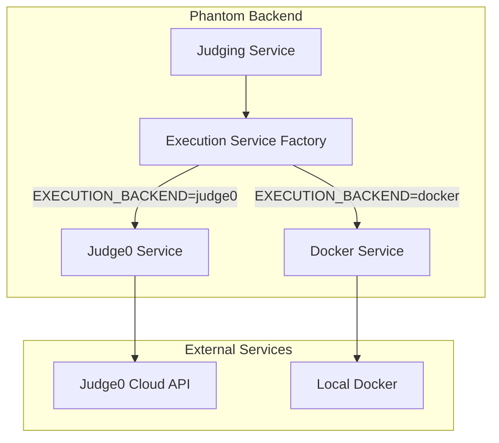
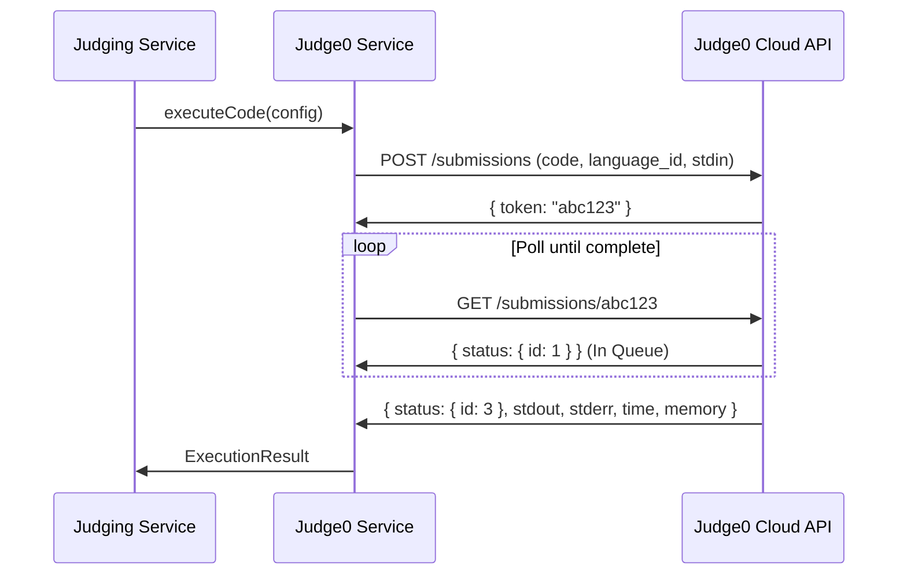

# Design Document: Judge0 Cloud Integration

## Overview

This design document describes the integration of Judge0 Cloud as the code execution backend for the Phantom competitive coding platform. The integration replaces the current Docker-based execution with a cloud-hosted solution that provides better scalability, reliability, and language support without requiring local Docker infrastructure.

The design maintains backward compatibility with the existing `ExecutionResult` interface, allowing the judging service to work without modification. An environment variable controls which execution backend is used, enabling gradual rollout and fallback capabilities.

## Architecture



### Execution Flow



## Components and Interfaces

### Judge0Service

The main service class that handles communication with Judge0 Cloud API.

```typescript
interface Judge0Config {
  apiKey: string;
  apiHost: string;
  cpuTimeLimit: number; // seconds
  memoryLimit: number; // kilobytes
  maxPollingTime: number; // milliseconds
  pollingInterval: number; // milliseconds
}

interface Judge0Submission {
  source_code: string;
  language_id: number;
  stdin?: string;
  cpu_time_limit?: number;
  memory_limit?: number;
}

interface Judge0Response {
  token: string;
  stdout: string | null;
  stderr: string | null;
  status: {
    id: number;
    description: string;
  };
  time: string | null;
  memory: number | null;
  compile_output: string | null;
}

class Judge0Service {
  constructor(config: Judge0Config);

  // Core execution method - maintains ExecutionConfig interface
  async executeCode(config: ExecutionConfig): Promise<ExecutionResult>;

  // Batch execution for multiple test cases
  async executeBatch(configs: ExecutionConfig[]): Promise<ExecutionResult[]>;

  // Health check
  async healthCheck(): Promise<boolean>;

  // Internal methods
  private async submitCode(submission: Judge0Submission): Promise<string>;
  private async pollResult(token: string): Promise<Judge0Response>;
  private mapLanguageToId(language: string): number;
  private mapResponseToResult(response: Judge0Response): ExecutionResult;
}
```

### ExecutionServiceFactory

Factory that selects the appropriate execution backend based on configuration.

```typescript
type ExecutionBackend = 'docker' | 'judge0';

interface ExecutionService {
  executeCode(config: ExecutionConfig): Promise<ExecutionResult>;
  healthCheck(): Promise<boolean>;
}

function createExecutionService(): ExecutionService {
  const backend = process.env.EXECUTION_BACKEND || 'docker';

  if (backend === 'judge0') {
    const apiKey = process.env.JUDGE0_API_KEY;
    if (!apiKey) {
      console.error('JUDGE0_API_KEY not set, falling back to Docker');
      return dockerService;
    }
    return new Judge0Service({ apiKey, ... });
  }

  return dockerService;
}
```

### Language Mapping

```typescript
const LANGUAGE_MAP: Record<string, number> = {
  javascript: 63, // Node.js (12.14.0)
  python: 71, // Python (3.8.1)
  typescript: 74, // TypeScript (3.7.4)
};
```

### Judge0 Status Codes

```typescript
enum Judge0Status {
  InQueue = 1,
  Processing = 2,
  Accepted = 3,
  WrongAnswer = 4,
  TimeLimitExceeded = 5,
  CompilationError = 6,
  RuntimeErrorSIGSEGV = 7,
  RuntimeErrorSIGXFSZ = 8,
  RuntimeErrorSIGFPE = 9,
  RuntimeErrorSIGABRT = 10,
  RuntimeErrorNZEC = 11,
  RuntimeErrorOther = 12,
  InternalError = 13,
  ExecFormatError = 14,
}
```

## Data Models

### ExecutionConfig (Existing - No Changes)

```typescript
interface ExecutionConfig {
  language: "javascript" | "python" | "typescript";
  code: string;
  testInput?: string;
  timeout?: number;
}
```

### ExecutionResult (Existing - No Changes)

```typescript
interface ExecutionResult {
  stdout: string;
  stderr: string;
  exitCode: number;
  executionTime: number;
  memoryUsage: number;
  timedOut: boolean;
}
```

### Judge0SubmissionRequest

```typescript
interface Judge0SubmissionRequest {
  source_code: string; // Base64 encoded
  language_id: number;
  stdin?: string; // Base64 encoded
  cpu_time_limit?: number; // seconds (default: 10)
  memory_limit?: number; // KB (default: 131072 = 128MB)
  base64_encoded?: boolean;
}
```

### Judge0SubmissionResponse

```typescript
interface Judge0SubmissionResponse {
  token: string;
  stdout: string | null; // Base64 encoded if requested
  stderr: string | null; // Base64 encoded if requested
  compile_output: string | null;
  message: string | null;
  status: {
    id: number;
    description: string;
  };
  time: string | null; // Execution time in seconds
  memory: number | null; // Memory usage in KB
}
```

## Correctness Properties

_A property is a characteristic or behavior that should hold true across all valid executions of a system-essentially, a formal statement about what the system should do. Properties serve as the bridge between human-readable specifications and machine-verifiable correctness guarantees._

### Property 1: Request Formation Completeness

_For any_ valid ExecutionConfig with code, language, and optional testInput, the Judge0 submission request SHALL contain source_code (base64 encoded), the correct language_id, and stdin (base64 encoded if testInput provided).

**Validates: Requirements 1.1**

### Property 2: Token Extraction Consistency

_For any_ Judge0 API response containing a token field, the service SHALL extract and return the token string without modification.

**Validates: Requirements 1.2**

### Property 3: Polling Request Correctness

_For any_ submission token, the polling request SHALL use the correct endpoint `/submissions/{token}` with the token value.

**Validates: Requirements 1.3**

### Property 4: Response Parsing Completeness

_For any_ completed Judge0 response, the resulting ExecutionResult SHALL contain: stdout (decoded from base64), stderr (decoded from base64), exitCode (derived from status.id), executionTime (parsed from time field in milliseconds), memoryUsage (from memory field in bytes), and timedOut (true if status.id indicates TLE).

**Validates: Requirements 1.4, 4.1**

### Property 5: Error Response Handling

_For any_ Judge0 API error response (4xx or 5xx status), the service SHALL return an ExecutionResult with exitCode non-zero and stderr containing the error description.

**Validates: Requirements 1.5**

### Property 6: Unsupported Language Rejection

_For any_ language string not in the supported set {javascript, python, typescript}, the service SHALL throw an error indicating the language is not supported.

**Validates: Requirements 2.4**

### Property 7: Judge0 Status Mapping

_For any_ Judge0 response with status.id equal to 5 (Time Limit Exceeded), the ExecutionResult SHALL have timedOut set to true. _For any_ Judge0 response with status.id equal to 6 or higher (errors), the ExecutionResult SHALL have exitCode non-zero and stderr containing the status description.

**Validates: Requirements 3.3, 3.4**

### Property 8: Interface Compatibility

_For any_ ExecutionConfig object with valid language, code, and optional testInput and timeout fields, the Judge0Service.executeCode method SHALL accept the config and return a Promise resolving to ExecutionResult.

**Validates: Requirements 4.2**

### Property 9: API Key Header Inclusion

_For any_ HTTP request made to Judge0 API, the request headers SHALL include X-RapidAPI-Key with the configured API key value.

**Validates: Requirements 5.3**

### Property 10: Authentication Error Handling

_For any_ Judge0 API response with status 401 or 403, the service SHALL return an ExecutionResult with stderr containing "authentication" or "unauthorized" (case-insensitive).

**Validates: Requirements 5.4**

### Property 11: Rate Limit Retry Behavior

_For any_ Judge0 API response with status 429, the service SHALL retry the request at least once before returning an error.

**Validates: Requirements 6.1**

### Property 12: Batch Submission Round-Trip

_For any_ array of ExecutionConfig objects, executeBatch SHALL return an array of ExecutionResult objects with the same length, where each result corresponds to the config at the same index.

**Validates: Requirements 7.1, 7.3**

### Property 13: Batch Chunking

_For any_ batch of more than 20 ExecutionConfig objects, the service SHALL split the batch into chunks of at most 20 submissions per API call.

**Validates: Requirements 7.2**

### Property 14: Partial Batch Failure Isolation

_For any_ batch where some submissions succeed and some fail, the returned array SHALL contain valid ExecutionResult objects for successful submissions and error ExecutionResult objects for failed submissions, without throwing an exception.

**Validates: Requirements 7.4**

## Error Handling

### API Errors

| Error Type    | HTTP Status | Handling Strategy                      |
| ------------- | ----------- | -------------------------------------- |
| Rate Limited  | 429         | Exponential backoff retry (1s, 2s, 4s) |
| Unauthorized  | 401, 403    | Log error, return auth error result    |
| Server Error  | 5xx         | Retry once, then return error result   |
| Network Error | N/A         | Retry once, then return error result   |
| Timeout       | N/A         | Return timedOut result                 |

### Status Code Mapping

```typescript
function mapStatusToResult(status: Judge0Status): Partial<ExecutionResult> {
  switch (status) {
    case Judge0Status.Accepted:
      return { exitCode: 0, timedOut: false };
    case Judge0Status.TimeLimitExceeded:
      return { exitCode: 124, timedOut: true, stderr: "Time limit exceeded" };
    case Judge0Status.CompilationError:
      return { exitCode: 1, timedOut: false };
    case Judge0Status.RuntimeErrorSIGSEGV:
    case Judge0Status.RuntimeErrorSIGXFSZ:
    case Judge0Status.RuntimeErrorSIGFPE:
    case Judge0Status.RuntimeErrorSIGABRT:
    case Judge0Status.RuntimeErrorNZEC:
    case Judge0Status.RuntimeErrorOther:
      return { exitCode: 1, timedOut: false };
    default:
      return { exitCode: 1, timedOut: false };
  }
}
```

### Fallback Strategy

When Judge0 is unavailable or API key is missing:

1. Log warning with details
2. Fall back to Docker execution service
3. Continue operation without interruption

## Testing Strategy

### Dual Testing Approach

This implementation uses both unit tests and property-based tests:

- **Unit tests**: Verify specific examples, edge cases, and integration points
- **Property-based tests**: Verify universal properties hold across all valid inputs

### Property-Based Testing Framework

The implementation will use **fast-check** for property-based testing in TypeScript. Each property test will run a minimum of 100 iterations.

### Test Categories

#### Unit Tests

- Language ID mapping for each supported language
- Default configuration values (CPU limit, memory limit)
- Environment variable reading
- Health check endpoint

#### Property-Based Tests

Each correctness property from the design will be implemented as a property-based test:

1. **Request Formation** - Generate random code strings and verify request structure
2. **Token Extraction** - Generate random token strings and verify extraction
3. **Response Parsing** - Generate random Judge0 responses and verify field mapping
4. **Error Handling** - Generate error responses and verify error results
5. **Status Mapping** - Generate all status codes and verify correct mapping
6. **Batch Operations** - Generate random batch sizes and verify chunking/aggregation

### Test Annotations

Each property-based test will be annotated with:

```typescript
// **Feature: judge0-cloud-integration, Property {number}: {property_text}**
```

### Mocking Strategy

- Mock HTTP client (axios/fetch) for API calls
- Use dependency injection for testability
- Generate realistic Judge0 response shapes with fast-check arbitraries
