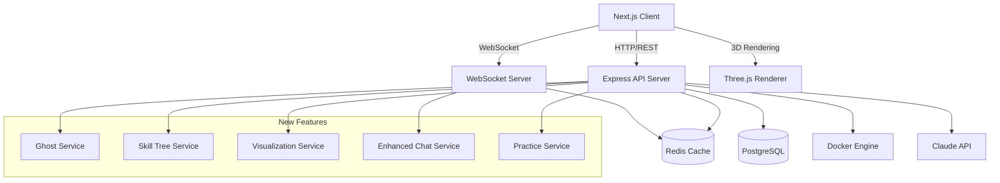
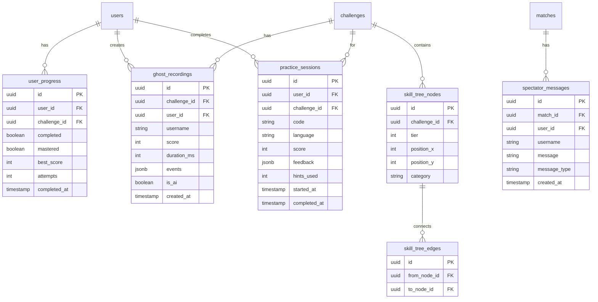

# Design Document

## Overview

This design document extends the Phantom Code Battle platform with five major new features: 3D Algorithm Visualization, Ghost Mode Racing, Enhanced Spectator Chat, Skill Tree Progression, and Solo Practice Mode. These features build upon the existing architecture of Next.js frontend, Express.js backend, PostgreSQL database, Redis caching, and WebSocket real-time communication.

### Key Design Principles

1. **Incremental Enhancement**: New features integrate seamlessly with existing systems
2. **Performance First**: 3D visualizations use WebGL with fallbacks for lower-end devices
3. **Progressive Unlocking**: Skill tree creates meaningful progression without blocking content
4. **Reusable Components**: Ghost mode leverages existing replay infrastructure
5. **Social Engagement**: Enhanced chat creates community around competitive coding

## Architecture

### Extended System Architecture



### New Database Tables



## Components and Interfaces

### Backend Services

#### 1. Ghost Service

```typescript
interface GhostRecording {
  id: string;
  challengeId: string;
  userId: string;
  username: string;
  score: number;
  durationMs: number;
  events: MatchEvent[];
  isAI: boolean;
  createdAt: Date;
}

interface GhostService {
  // Get available ghosts for a challenge
  getGhostsForChallenge(challengeId: string): Promise<GhostRecording[]>;

  // Get a specific ghost recording
  getGhost(ghostId: string): Promise<GhostRecording | null>;

  // Save a new ghost recording from a winning match
  saveGhostFromMatch(matchId: string, playerId: string): Promise<GhostRecording>;

  // Generate AI ghost for challenges without recordings
  generateAIGhost(challengeId: string): Promise<GhostRecording>;

  // Get top ghost (fastest/highest score) for a challenge
  getTopGhost(challengeId: string): Promise<GhostRecording | null>;
}
```

#### 2. Skill Tree Service

```typescript
interface SkillTreeNode {
  id: string;
  challengeId: string;
  tier: number;
  positionX: number;
  positionY: number;
  category: string;
  challenge: Challenge;
  prerequisites: string[]; // node IDs
  isUnlocked: boolean;
  isCompleted: boolean;
  isMastered: boolean;
}

interface UserProgress {
  id: string;
  userId: string;
  challengeId: string;
  completed: boolean;
  mastered: boolean;
  bestScore: number;
  attempts: number;
  completedAt: Date | null;
}

interface SkillTreeService {
  // Get full skill tree with user progress
  getSkillTree(userId: string): Promise<SkillTreeNode[]>;

  // Check if a challenge is unlocked for user
  isChallengeUnlocked(userId: string, challengeId: string): Promise<boolean>;

  // Update progress after completing a challenge
  updateProgress(userId: string, challengeId: string, score: number): Promise<UserProgress>;

  // Get user's unlocked challenges
  getUnlockedChallenges(userId: string): Promise<Challenge[]>;

  // Check mastery (score >= 90%)
  checkMastery(score: number): boolean;
}
```

#### 3. Practice Service

```typescript
interface PracticeSession {
  id: string;
  userId: string;
  challengeId: string;
  code: string;
  language: string;
  score: number | null;
  feedback: AIFeedback | null;
  hintsUsed: number;
  startedAt: Date;
  completedAt: Date | null;
}

interface PracticeHint {
  level: number; // 1-3, increasing detail
  content: string;
}

interface PracticeService {
  // Start a new practice session
  startSession(userId: string, challengeId: string, language: string): Promise<PracticeSession>;

  // Save progress during practice
  saveProgress(sessionId: string, code: string): Promise<void>;

  // Submit solution for evaluation (no rating impact)
  submitSolution(sessionId: string, code: string): Promise<PracticeSession>;

  // Get progressive hints
  getHint(sessionId: string, challengeId: string, hintLevel: number): Promise<PracticeHint>;

  // Get practice history for user
  getPracticeHistory(userId: string): Promise<PracticeSession[]>;
}
```

#### 4. Visualization Service

```typescript
interface VisualizationStep {
  timestamp: number;
  operation: "compare" | "swap" | "insert" | "delete" | "visit" | "highlight";
  indices: number[];
  values?: any[];
  metadata?: Record<string, any>;
}

interface VisualizationData {
  type: "array" | "tree" | "graph";
  initialState: any;
  steps: VisualizationStep[];
}

interface VisualizationService {
  // Parse code execution trace for visualization
  parseExecutionTrace(stdout: string, dataType: string): VisualizationData;

  // Generate visualization from test case execution
  generateVisualization(code: string, language: string, testCase: TestCase): Promise<VisualizationData>;
}
```

#### 5. Enhanced Chat Service

```typescript
interface SpectatorMessage {
  id: string;
  matchId: string;
  userId: string;
  username: string;
  message: string;
  messageType: "text" | "emoji" | "reaction";
  createdAt: Date;
}

interface ChatService {
  // Send message with rate limiting
  sendMessage(matchId: string, userId: string, message: string): Promise<SpectatorMessage>;

  // Send emoji reaction
  sendReaction(matchId: string, userId: string, emoji: string): Promise<void>;

  // Get chat history for a match
  getChatHistory(matchId: string): Promise<SpectatorMessage[]>;

  // Check rate limit (1 message per 2 seconds)
  checkRateLimit(userId: string): Promise<boolean>;

  // Filter inappropriate content
  filterMessage(message: string): string;
}
```

### API Endpoints

#### Ghost Mode Routes (`/api/ghosts`)

```typescript
GET /api/ghosts/challenge/:challengeId
Response: { ghosts: GhostRecording[] }

GET /api/ghosts/:ghostId
Response: { ghost: GhostRecording }

POST /api/ghosts/from-match
Request: { matchId: string }
Response: { ghost: GhostRecording }

POST /api/ghosts/race
Request: { challengeId: string, ghostId: string }
Response: { raceId: string, ghost: GhostRecording }
```

#### Skill Tree Routes (`/api/skill-tree`)

```typescript
GET /api/skill-tree
Response: { nodes: SkillTreeNode[], edges: SkillTreeEdge[] }

GET /api/skill-tree/progress
Response: { progress: UserProgress[] }

GET /api/skill-tree/unlocked
Response: { challenges: Challenge[] }

POST /api/skill-tree/check-unlock
Request: { challengeId: string }
Response: { unlocked: boolean, prerequisites: string[] }
```

#### Practice Routes (`/api/practice`)

```typescript
GET /api/practice/challenges
Query: { difficulty?: string, category?: string }
Response: { challenges: Challenge[] }

POST /api/practice/start
Request: { challengeId: string, language: string }
Response: { session: PracticeSession }

POST /api/practice/:sessionId/save
Request: { code: string }
Response: { success: boolean }

POST /api/practice/:sessionId/submit
Request: { code: string }
Response: { session: PracticeSession, feedback: AIFeedback }

POST /api/practice/:sessionId/hint
Request: { level: number }
Response: { hint: PracticeHint }

GET /api/practice/history
Response: { sessions: PracticeSession[] }
```

#### Visualization Routes (`/api/visualization`)

```typescript
POST /api/visualization/generate
Request: { code: string, language: string, testCase: TestCase, dataType: string }
Response: { visualization: VisualizationData }
```

### WebSocket Events

#### Ghost Mode Events

```typescript
// Client → Server
'start_ghost_race': { challengeId: string, ghostId: string }
'ghost_race_code_update': { raceId: string, code: string }
'ghost_race_submit': { raceId: string, code: string }

// Server → Client
'ghost_race_started': { raceId: string, ghost: GhostRecording, challenge: Challenge }
'ghost_code_update': { code: string, cursor: Position, timestamp: number }
'ghost_test_run': { results: TestResult[] }
'ghost_race_result': { playerScore: number, ghostScore: number, won: boolean }
```

#### Enhanced Chat Events

```typescript
// Client → Server
'spectator_message': { matchId: string, message: string }
'spectator_reaction': { matchId: string, emoji: string }

// Server → Client
'spectator_message': { id: string, username: string, message: string, timestamp: number }
'spectator_reaction': { username: string, emoji: string, position: { x: number, y: number } }
'chat_rate_limited': { retryAfter: number }
```

### Frontend Components

#### 1. Algorithm Visualization Component

```typescript
interface AlgorithmVisualizerProps {
  data: VisualizationData;
  isPlaying: boolean;
  speed: number;
  onStepChange: (step: number) => void;
}

// Uses Three.js for 3D rendering
// Supports array bars, tree nodes, graph force-directed layout
// Smooth transitions between states
// Toggle between 2D and 3D views
```

#### 2. Ghost Race Component

```typescript
interface GhostRaceProps {
  challengeId: string;
  ghostId: string;
  onComplete: (result: GhostRaceResult) => void;
}

// Split view: player editor + ghost editor (semi-transparent)
// Ghost progress indicator
// Real-time comparison metrics
```

#### 3. Skill Tree Component

```typescript
interface SkillTreeProps {
  nodes: SkillTreeNode[];
  edges: SkillTreeEdge[];
  onNodeClick: (node: SkillTreeNode) => void;
}

// Interactive node graph with zoom/pan
// Visual states: locked (gray), unlocked (cyan), completed (lime), mastered (gold)
// Animated connections between nodes
// Category filtering
```

#### 4. Practice Mode Component

```typescript
interface PracticeModeProps {
  challenge: Challenge;
  session: PracticeSession;
  onSubmit: (code: string) => void;
  onHintRequest: (level: number) => void;
}

// No timer display
// Hint button with progressive reveal
// Unlimited test runs
// AI feedback panel
```

#### 5. Enhanced Spectator Chat Component

```typescript
interface SpectatorChatProps {
  matchId: string;
  messages: SpectatorMessage[];
  onSendMessage: (message: string) => void;
  onSendReaction: (emoji: string) => void;
}

// Message list with timestamps
// Emoji picker for reactions
// Floating reaction animations
// Rate limit indicator
```

## Data Models

### Ghost Recording Model

```typescript
interface GhostRecording {
  id: string;
  challenge_id: string;
  user_id: string;
  username: string;
  score: number;
  duration_ms: number;
  events: MatchEvent[]; // Reuses existing MatchEvent structure
  is_ai: boolean;
  created_at: Date;
}
```

### Skill Tree Node Model

```typescript
interface SkillTreeNode {
  id: string;
  challenge_id: string;
  tier: number; // 1-5, determines vertical position
  position_x: number; // Horizontal position in tier
  position_y: number; // Calculated from tier
  category: string; // 'arrays', 'strings', 'trees', 'graphs', 'dp'
}

interface SkillTreeEdge {
  id: string;
  from_node_id: string;
  to_node_id: string;
}
```

### User Progress Model

```typescript
interface UserProgress {
  id: string;
  user_id: string;
  challenge_id: string;
  completed: boolean;
  mastered: boolean; // score >= 90%
  best_score: number;
  attempts: number;
  completed_at: Date | null;
}
```

### Practice Session Model

```typescript
interface PracticeSession {
  id: string;
  user_id: string;
  challenge_id: string;
  code: string;
  language: string;
  score: number | null;
  feedback: {
    correctness: number;
    efficiency: number;
    quality: number;
    suggestions: string[];
  } | null;
  hints_used: number;
  started_at: Date;
  completed_at: Date | null;
}
```

### Spectator Message Model

```typescript
interface SpectatorMessage {
  id: string;
  match_id: string;
  user_id: string;
  username: string;
  message: string;
  message_type: "text" | "emoji" | "reaction";
  created_at: Date;
}
```

## Correctness Properties

_A property is a characteristic or behavior that should hold true across all valid executions of a system-essentially, a formal statement about what the system should do. Properties serve as the bridge between human-readable specifications and machine-verifiable correctness guarantees._

### Property 1: Visualization data validity

_For any_ code execution trace with array, tree, or graph operations, the visualization service SHALL produce a VisualizationData object containing a valid type, non-empty initialState, and steps array where each step has a valid operation type and indices. **Validates: Requirements 13.1, 13.2, 13.3**

### Property 2: Visualization toggle independence

_For any_ code execution, running with visualization enabled or disabled SHALL produce identical test results and scores. **Validates: Requirements 13.5**

### Property 3: Ghost playback accuracy

_For any_ ghost recording and timestamp T within the recording duration, querying the ghost state at time T SHALL return the code state that matches the recorded event at or before T. **Validates: Requirements 14.2**

### Property 4: Ghost race comparison consistency

_For any_ two race performances (player and ghost), the comparison function SHALL consistently determine the winner based on: higher score wins, or if scores are equal, faster completion time wins. **Validates: Requirements 14.4**

### Property 5: Chat message broadcast correctness

_For any_ spectator message sent to a match, all spectators currently watching that match SHALL receive the message, and no spectators watching other matches SHALL receive it. **Validates: Requirements 15.1**

### Property 6: Chat message structure completeness

_For any_ spectator message, the message object SHALL contain non-empty username, message content, and valid timestamp. **Validates: Requirements 15.2**

### Property 7: Chat rate limiting enforcement

_For any_ user sending messages, if the user sends more than 1 message within 2 seconds, subsequent messages SHALL be rejected until the rate limit window expires. **Validates: Requirements 15.4**

### Property 8: Chat history persistence

_For any_ completed match with spectator messages, querying chat history after match completion SHALL return all messages that were sent during the match. **Validates: Requirements 15.5**

### Property 9: Content filter effectiveness

_For any_ message containing words from the blocked word list, the filter function SHALL either sanitize the message by removing/replacing blocked content or reject the message entirely. **Validates: Requirements 15.6**

### Property 10: New user initial unlock state

_For any_ newly registered user, the skill tree service SHALL return all tier-1 challenges as unlocked and all higher-tier challenges as locked. **Validates: Requirements 16.1**

### Property 11: Challenge completion unlocks connected nodes

_For any_ challenge completion with a passing score, all challenges directly connected to the completed challenge in the skill tree SHALL become unlocked for that user. **Validates: Requirements 16.2**

### Property 12: Locked challenge prerequisites retrieval

_For any_ locked challenge, querying its prerequisites SHALL return a non-empty list of challenge IDs that must be completed to unlock it. **Validates: Requirements 16.4**

### Property 13: Mastery threshold correctness

_For any_ challenge completion, if the score is >= 90 then mastery SHALL be true, and if the score is < 90 then mastery SHALL be false. **Validates: Requirements 16.5**

### Property 14: Practice mode returns only unlocked challenges

_For any_ user in practice mode, the challenge list SHALL contain only challenges that are unlocked for that user according to the skill tree. **Validates: Requirements 17.1**

### Property 15: Practice submissions preserve rating

_For any_ practice session submission, the user's rating before and after submission SHALL be equal. **Validates: Requirements 17.3**

### Property 16: Practice completion includes feedback

_For any_ completed practice session, the session object SHALL contain non-null feedback with correctness, efficiency, and quality scores. **Validates: Requirements 17.4**

### Property 17: Practice history completeness

_For any_ user with practice sessions, querying practice history SHALL return all sessions for that user with scores and timestamps. **Validates: Requirements 17.5**

### Property 18: Progressive hint detail

_For any_ challenge and hint levels 1, 2, and 3, the hint content length at level N+1 SHALL be greater than or equal to the hint content length at level N. **Validates: Requirements 17.6**

## Error Handling

### Ghost Mode Errors

**No Ghost Available**

- If no ghost recording exists for a challenge, generate AI ghost on-demand
- Display loading state while AI ghost is being generated
- Fall back to practice mode if AI generation fails

**Ghost Sync Errors**

- If ghost playback falls out of sync, resync to nearest event
- Display warning if significant desync detected
- Allow manual resync via timeline scrubber

### Skill Tree Errors

**Circular Dependency Detection**

- Validate skill tree structure on load to detect cycles
- Log error and skip problematic edges
- Ensure user can always progress

**Progress Sync Errors**

- Cache progress locally and sync when connection restored
- Display pending sync indicator
- Retry failed progress updates with exponential backoff

### Practice Mode Errors

**Hint Generation Failures**

- If AI hint generation fails, provide pre-written fallback hints
- Log failure for monitoring
- Allow retry after cooldown

**Session Recovery**

- Auto-save code every 30 seconds
- Restore session on page reload
- Prompt user to continue or start fresh

### Chat Errors

**Rate Limit Exceeded**

- Display countdown timer until next message allowed
- Queue message for automatic send when limit expires
- Visual feedback on send button

**Content Filter False Positives**

- Allow user to request manual review
- Log filtered messages for moderation review
- Provide appeal mechanism

## Testing Strategy

### Dual Testing Approach

This implementation uses both unit tests and property-based tests:

- **Unit tests** verify specific examples, edge cases, and integration points
- **Property-based tests** verify universal properties that should hold across all inputs

### Property-Based Testing Framework

The implementation will use **fast-check** for TypeScript/JavaScript property-based testing.

Configuration:

- Minimum 100 iterations per property test
- Seed logging for reproducibility
- Shrinking enabled for minimal failing examples

### Test Organization

Each property-based test MUST be tagged with:

```typescript
// **Feature: phantom-code-battle, Property {number}: {property_text}**
```

### Unit Test Coverage

**Ghost Service**

- Ghost recording retrieval by challenge ID
- Ghost creation from match events
- AI ghost generation with optimal timing
- Edge case: empty events array

**Skill Tree Service**

- Initial unlock state for new users
- Unlock propagation after completion
- Mastery detection at boundary (89%, 90%, 91%)
- Circular dependency handling

**Practice Service**

- Session creation and retrieval
- Code auto-save functionality
- Hint level progression
- Rating preservation verification

**Chat Service**

- Message broadcast to correct room
- Rate limiting enforcement
- Content filtering accuracy
- History persistence after match end

**Visualization Service**

- Array operation parsing
- Tree traversal visualization
- Graph edge highlighting
- Large data aggregation (>1000 elements)

### Integration Tests

**Ghost Race Flow**

1. User selects ghost for challenge
2. Race starts with ghost playback
3. User submits solution
4. Results compared and displayed

**Skill Tree Progression**

1. New user sees tier-1 unlocked
2. User completes challenge
3. Connected challenges unlock
4. Mastery badge awarded at 90%+

**Practice Mode Flow**

1. User enters practice mode
2. Selects unlocked challenge
3. Runs tests (unlimited)
4. Requests hints (progressive)
5. Submits for feedback
6. Rating unchanged

### Property-Based Test Examples

```typescript
// **Feature: phantom-code-battle, Property 13: Mastery threshold correctness**
test("mastery is true iff score >= 90", () => {
  fc.assert(
    fc.property(fc.integer({ min: 0, max: 100 }), (score) => {
      const result = skillTreeService.checkMastery(score);
      return score >= 90 ? result === true : result === false;
    }),
    { numRuns: 100 }
  );
});

// **Feature: phantom-code-battle, Property 7: Chat rate limiting enforcement**
test("rate limiting rejects rapid messages", () => {
  fc.assert(
    fc.property(fc.array(fc.integer({ min: 0, max: 5000 }), { minLength: 2, maxLength: 10 }), (timestamps) => {
      // Simulate messages at given timestamps
      const results = timestamps.map((ts, i) => chatService.checkRateLimit(userId, ts));
      // Messages within 2000ms of each other should be rate limited
      for (let i = 1; i < timestamps.length; i++) {
        if (timestamps[i] - timestamps[i - 1] < 2000) {
          expect(results[i]).toBe(false);
        }
      }
      return true;
    }),
    { numRuns: 100 }
  );
});
```

## UI/UX Design

### 3D Visualization Design

**Array Visualization**

- Vertical bars representing array elements
- Height proportional to value
- Color coding: comparing (yellow), swapping (red), sorted (green)
- Camera orbit controls for 3D viewing

**Tree Visualization**

- Hierarchical node layout
- Edges as 3D tubes connecting nodes
- Node highlighting for current operation
- Expandable/collapsible subtrees

**Graph Visualization**

- Force-directed 3D layout
- Nodes as spheres, edges as lines
- Visited nodes glow effect
- Path highlighting for traversals

### Ghost Mode UI

**Split View Layout**

- Left 60%: Player's editor (full opacity)
- Right 40%: Ghost's editor (50% opacity, cyan tint)
- Progress bar showing ghost's timeline position
- Real-time score comparison widget

### Skill Tree UI

**Node States**

- Locked: Gray, no glow, lock icon
- Unlocked: Cyan border, subtle pulse
- Completed: Lime fill, checkmark
- Mastered: Gold border, star icon, particle effect

**Interactions**

- Click node to view challenge details
- Hover to see prerequisites
- Zoom/pan with mouse/touch
- Category filter tabs

### Practice Mode UI

**Relaxed Layout**

- No timer display
- Hint button with level indicator (1/3, 2/3, 3/3)
- "No pressure" messaging
- Progress saved indicator

### Enhanced Chat UI

**Message Display**

- Username in accent color
- Timestamp in muted text
- Emoji reactions float up and fade
- Typing indicator for active users

**Input Area**

- Text input with emoji picker
- Rate limit countdown when active
- Quick reaction buttons

## Deployment Considerations

### Database Migrations

New tables required:

1. `ghost_recordings` - Store ghost data
2. `skill_tree_nodes` - Define skill tree structure
3. `skill_tree_edges` - Define node connections
4. `user_progress` - Track user completion
5. `practice_sessions` - Store practice attempts
6. `spectator_messages` - Persist chat history

### Redis Keys

New Redis structures:

- `ghost:challenge:{id}` - Cached ghost list per challenge
- `skilltree:user:{id}` - Cached user progress
- `practice:session:{id}` - Active practice session state
- `chat:ratelimit:{userId}` - Rate limit counters
- `chat:match:{matchId}` - Live chat messages

### Performance Considerations

**3D Visualization**

- WebGL detection with 2D fallback
- Level-of-detail for large datasets
- Lazy loading of visualization assets

**Ghost Playback**

- Pre-load ghost events on race start
- Efficient binary search for timestamp lookup
- Memory-efficient event storage

**Skill Tree**

- Cache full tree structure (changes rarely)
- Incremental progress updates
- Batch unlock calculations

This design provides a comprehensive blueprint for implementing the new features while maintaining compatibility with the existing Phantom platform architecture.
