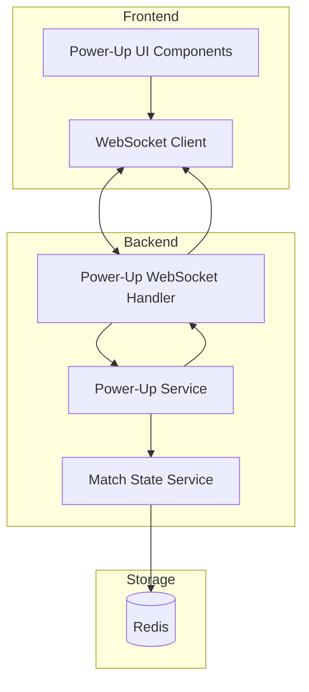

# Power-Ups System Design Document

## Overview

The Power-Ups System adds strategic depth to coding battles by providing players with three consumable abilities: Time Freeze, Code Peek, and Debug Shield. This system integrates with the existing match infrastructure, leveraging Redis for real-time state management and WebSocket for instant communication between players and spectators.

The system follows a resource-management design where each player receives a fixed allocation of power-ups at match start, must manage a global cooldown between uses, and can leverage these abilities to gain tactical advantages during competitive coding.

## Architecture

The Power-Ups System follows the existing service-oriented architecture pattern used throughout the codebase:



### Data Flow

1. Player clicks power-up button in UI
2. WebSocket client sends `activate_powerup` event
3. Power-Up Handler validates request and delegates to Power-Up Service
4. Power-Up Service updates match state in Redis via Match State Service
5. Power-Up Service returns result to handler
6. Handler broadcasts events to relevant parties (player, opponent, spectators)

## Components and Interfaces

### PowerUpService

The core service managing power-up logic and state transitions.

```typescript
interface PowerUpService {
  // Initialize power-ups for a new match
  initializePowerUps(matchId: string, player1Id: string, player2Id: string): Promise<void>;

  // Activate a power-up for a player
  activatePowerUp(matchId: string, playerId: string, powerUpType: PowerUpType): Promise<PowerUpActivationResult>;

  // Get current power-up state for a player
  getPlayerPowerUps(matchId: string, playerId: string): Promise<PlayerPowerUpState>;

  // Get power-up state for entire match
  getMatchPowerUpState(matchId: string): Promise<MatchPowerUpState>;

  // Check if player can use a power-up (cooldown check)
  canUsePowerUp(matchId: string, playerId: string): Promise<CooldownCheckResult>;

  // Consume a Debug Shield charge (called on test run)
  consumeDebugShieldCharge(matchId: string, playerId: string): Promise<DebugShieldStatus>;

  // Calculate effective time remaining for a player (accounts for Time Freeze)
  calculateEffectiveTimeRemaining(matchId: string, playerId: string, baseTimeRemaining: number): Promise<number>;
}
```

### PowerUpWebSocketHandler

Handles WebSocket events for power-up interactions.

```typescript
interface PowerUpWebSocketHandler {
  // Handle power-up activation request
  handleActivatePowerUp(socket: AuthenticatedSocket, data: { matchId: string; powerUpType: PowerUpType }): Promise<void>;

  // Broadcast power-up activation to relevant parties
  broadcastPowerUpActivation(matchId: string, playerId: string, powerUpType: PowerUpType, targetPlayerId?: string): void;

  // Send power-up state update to a player
  sendPowerUpStateUpdate(socketId: string, state: PlayerPowerUpState): void;
}
```

### PowerUpStateManager (Redis Integration)

Extends the existing MatchStateService to handle power-up state.

```typescript
interface PowerUpStateManager {
  // Store power-up state in Redis
  setPowerUpState(matchId: string, state: MatchPowerUpState): Promise<void>;

  // Retrieve power-up state from Redis
  getPowerUpState(matchId: string): Promise<MatchPowerUpState | null>;

  // Update specific player's power-up inventory
  updatePlayerInventory(matchId: string, playerId: string, inventory: PowerUpInventory): Promise<void>;

  // Update cooldown timestamp
  updateCooldown(matchId: string, playerId: string, cooldownUntil: number): Promise<void>;

  // Update active effect state
  updateActiveEffect(matchId: string, playerId: string, effect: ActivePowerUpEffect | null): Promise<void>;
}
```

## Data Models

### Core Types

```typescript
// Power-up type enumeration
type PowerUpType = "time_freeze" | "code_peek" | "debug_shield";

// Individual power-up inventory counts
interface PowerUpInventory {
  timeFreeze: number; // Default: 1
  codePeek: number; // Default: 1
  debugShield: number; // Default: 1
}

// Active power-up effect (only one can be active at a time per player)
interface ActivePowerUpEffect {
  type: PowerUpType;
  activatedAt: number; // Unix timestamp
  expiresAt: number; // Unix timestamp (for time_freeze)
  remainingCharges?: number; // For debug_shield (starts at 3)
}

// Per-player power-up state
interface PlayerPowerUpState {
  playerId: string;
  inventory: PowerUpInventory;
  cooldownUntil: number | null; // Unix timestamp when cooldown expires
  activeEffect: ActivePowerUpEffect | null;
}

// Complete match power-up state
interface MatchPowerUpState {
  matchId: string;
  player1: PlayerPowerUpState;
  player2: PlayerPowerUpState;
  createdAt: number;
  updatedAt: number;
}

// Result of power-up activation attempt
interface PowerUpActivationResult {
  success: boolean;
  error?: string;
  errorCode?: "NO_POWERUP" | "ON_COOLDOWN" | "MATCH_NOT_ACTIVE" | "INVALID_TYPE";
  cooldownRemaining?: number;
  newState?: PlayerPowerUpState;
  // For Code Peek
  opponentCode?: string;
  // For Time Freeze
  freezeExpiresAt?: number;
  // For Debug Shield
  shieldedRunsRemaining?: number;
}

// Cooldown check result
interface CooldownCheckResult {
  canUse: boolean;
  cooldownRemaining: number; // 0 if can use
}

// Debug Shield status after consuming a charge
interface DebugShieldStatus {
  isActive: boolean;
  remainingCharges: number;
  wasConsumed: boolean;
}
```

### WebSocket Event Types

```typescript
// Client to Server Events
interface PowerUpClientEvents {
  activate_powerup: (data: { matchId: string; powerUpType: PowerUpType }) => void;
}

// Server to Client Events
interface PowerUpServerEvents {
  powerup_activated: (data: {
    playerId: string;
    powerUpType: PowerUpType;
    // Type-specific data
    opponentCode?: string; // For code_peek (only to requester)
    freezeExpiresAt?: number; // For time_freeze
    shieldedRuns?: number; // For debug_shield
  }) => void;

  powerup_state_update: (data: PlayerPowerUpState) => void;

  powerup_error: (data: { error: string; code: string; cooldownRemaining?: number }) => void;

  powerup_effect_expired: (data: { playerId: string; powerUpType: PowerUpType }) => void;

  opponent_used_powerup: (data: {
    powerUpType: PowerUpType;
    // Limited info - opponent shouldn't see code_peek content
  }) => void;

  // For spectators
  spectator_powerup_event: (data: { playerId: string; username: string; powerUpType: PowerUpType; timestamp: number }) => void;
}
```

### Redis Storage Schema

Power-up state is stored as a hash within the existing match state structure:

```
Key: match:{matchId}:powerups
Fields:
  - player1State: JSON string of PlayerPowerUpState
  - player2State: JSON string of PlayerPowerUpState
  - updatedAt: Unix timestamp
TTL: Same as match TTL (3600 seconds)
```

## Correctness Properties

_A property is a characteristic or behavior that should hold true across all valid executions of a system-essentially, a formal statement about what the system should do. Properties serve as the bridge between human-readable specifications and machine-verifiable correctness guarantees._

### Property 1: Power-up allocation invariant

_For any_ match that transitions to active status, both players SHALL have exactly one Time Freeze, one Code Peek, and one Debug Shield in their inventory.

**Validates: Requirements 1.1, 1.2**

### Property 2: Power-up consumption decrements inventory

_For any_ valid power-up activation (player has power-up available and not on cooldown), the corresponding power-up count in the player's inventory SHALL decrease by exactly one.

**Validates: Requirements 1.4**

### Property 3: Time Freeze timer isolation

_For any_ match where one player activates Time Freeze, that player's effective time remaining SHALL be extended by the freeze duration, while the opponent's effective time remaining SHALL be unaffected by the freeze.

**Validates: Requirements 2.1, 2.2, 2.3**

### Property 4: Code Peek returns opponent's current code

_For any_ Code Peek activation, the returned code snapshot SHALL equal the opponent's current code stored in the match state at the moment of activation.

**Validates: Requirements 3.1**

### Property 5: Debug Shield lifecycle

_For any_ Debug Shield activation, the shield SHALL start with 3 charges, each test run while active SHALL consume exactly one charge, and the shield SHALL deactivate when charges reach zero.

**Validates: Requirements 4.1, 4.2, 4.3**

### Property 6: Cooldown enforcement

_For any_ power-up activation, a 60-second cooldown SHALL be initiated, and _for any_ subsequent activation attempt within that period, the system SHALL reject the request and return the remaining cooldown time.

**Validates: Requirements 6.1, 6.2, 6.3, 6.4**

### Property 7: Spectator event payload completeness

_For any_ power-up activation broadcast to spectators, the event payload SHALL contain the power-up type and the activating player's identifier.

**Validates: Requirements 7.2**

### Property 8: Power-up state round-trip consistency

_For any_ valid MatchPowerUpState, serializing to JSON and then deserializing SHALL produce an equivalent data structure with all fields preserved.

**Validates: Requirements 8.1, 8.2, 8.3, 9.1, 9.2, 9.3**

## Error Handling

### Validation Errors

| Error Code         | Condition                          | Response                                 |
| ------------------ | ---------------------------------- | ---------------------------------------- |
| `NO_POWERUP`       | Player has 0 of requested power-up | 400 Bad Request with remaining inventory |
| `ON_COOLDOWN`      | Player is within cooldown period   | 400 Bad Request with cooldown remaining  |
| `MATCH_NOT_ACTIVE` | Match is not in active status      | 400 Bad Request                          |
| `INVALID_TYPE`     | Unknown power-up type              | 400 Bad Request                          |
| `UNAUTHORIZED`     | Player not in this match           | 403 Forbidden                            |
| `MATCH_NOT_FOUND`  | Match doesn't exist                | 404 Not Found                            |

### Recovery Strategies

1. **Redis Connection Failure**: Fall back to database match state, log error, retry with exponential backoff
2. **WebSocket Disconnection**: Power-up state persists in Redis; restored on reconnection
3. **Timer Desync**: Periodic timer_sync events include power-up effect adjustments

## Testing Strategy

### Unit Testing

Unit tests will cover:

- PowerUpService methods in isolation with mocked Redis
- Validation logic for power-up activation
- Time calculation functions for Time Freeze
- Debug Shield charge consumption logic

### Property-Based Testing

The system will use `fast-check` for property-based testing in TypeScript. Each correctness property will be implemented as a property-based test with a minimum of 100 iterations.

Property tests will:

- Generate random match states and power-up inventories
- Verify invariants hold across all generated inputs
- Test edge cases like zero inventory, expired cooldowns, and concurrent activations

Each property-based test MUST be tagged with a comment in the format: `**Feature: power-ups-system, Property {number}: {property_text}**`

### Integration Testing

Integration tests will verify:

- WebSocket event flow for power-up activation
- Redis state persistence and retrieval
- Interaction with existing match state service
- Spectator broadcast functionality
